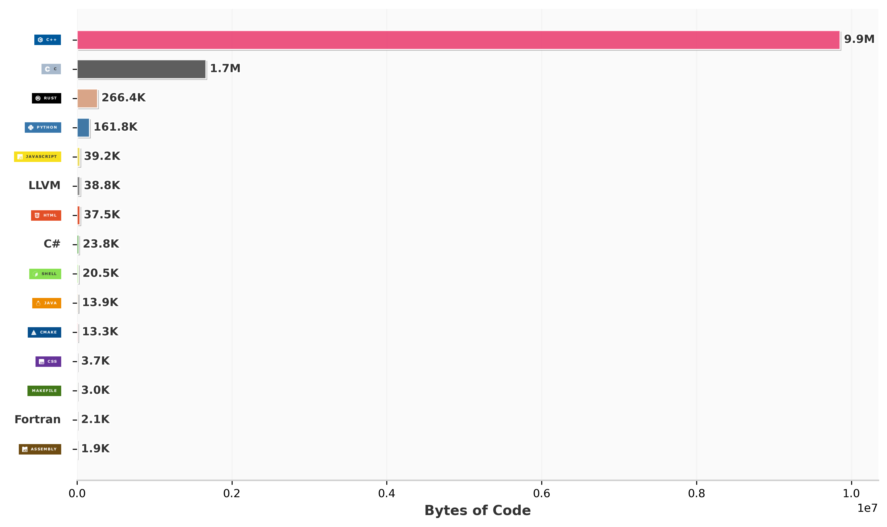

<!--https://github-readme-stats.vercel.app/api?username=TokynBlast&show_icons=true&theme=dracula-->
<div align="center">
  <h1>🏳️‍⚧️ Hi there! </h1>
  
  <a href="https://git.io/typing-svg">
    
  </a>
</div>

<br>


void me() {  

* 👂 `My name is`: **Ashley**,
* 🥔 `Noun Pros`: **she/her**,
* ⚡ `I'm`: **3892 years old**,
* 🌱 `I’m currently learning`: **C++**, <!-- i forgor... -->
* ❤️ `I love`: **Minis**  ,
* 💻 `Favorite lang`: **C++, & Rust**,

}
<br><br>
<h2 align="center">🌱 My Skills</h2>

<h4 align="center"> Programming languages (and HTML)</h4>

<p align="center">
<a href="#"></a>
<a href="https://github.com/search?q=user%3ATokynBlast+language%3Apython&type=code"></a>
<a href="https://github.com/search?q=user%3ATokynBlast+language%3AHTML+&type=repositories"></a>
<a href="#"></a>
<a href="https://github.com/search?q=user%3ATokynBlast+language%3Acss&type=code"></a>
<a href="#"></a>
<a href="#"></a>
<a href="https://github.com/search?q=user%3ATokynBlast+language%3Amarkdown&type=code"></a>
<a href="#"></a>
<a href="#"></a>
</p>
<br>

<h4 align="center">🏫 Plan To Learn</h4>
<p align="center">
<a href="https://github.com/search?q=user%3ATokynBlast+language%3AJavaScript+&type=repositories"></a>
</p>
<br>

<h4 align="center">⚙ Software, Frameworks and Apps</h4>

<p align="center">
<a href="https://icons8.com"></a>
<a href="https://repl.it"></a>
<a href="#"></a>
<a href="#"></a>
<a href="#"></a>
<a href="#"></a>
<a href="#"></a>
<a href="#"></a>
<a href="#"></a>
</p>
<br><br><br>
<h2 align="center">🖥️ Software/Code I Enjoy</h2>

<!--Add a thing for programs I have made that are my favorite here!-->

<p align="center">
<a href="#"></a>
<a href="https://github.com/TokynBlast/pyTGM"></a>
<a href="https://github.com/sammwyy/mikumikubeam"></a>
<a href="https://github.com/TokynBlast/minis"></a>
</p>

<br><br>
<h1>GitHub Stats</h1>

<br><br><br>

```zig
pub fn main() void {
  const Email: []const u8 = "ashleys-github@estrogen.delivery";
  const YouTube: []const u8 = "@Ashsicle";
  const Twitch: []const u8 = "tanomaa";
  const Twitter: []const u8 = "ashley_x86";
  const WebSite: []const u8 = "swimming.cat";
}
```
